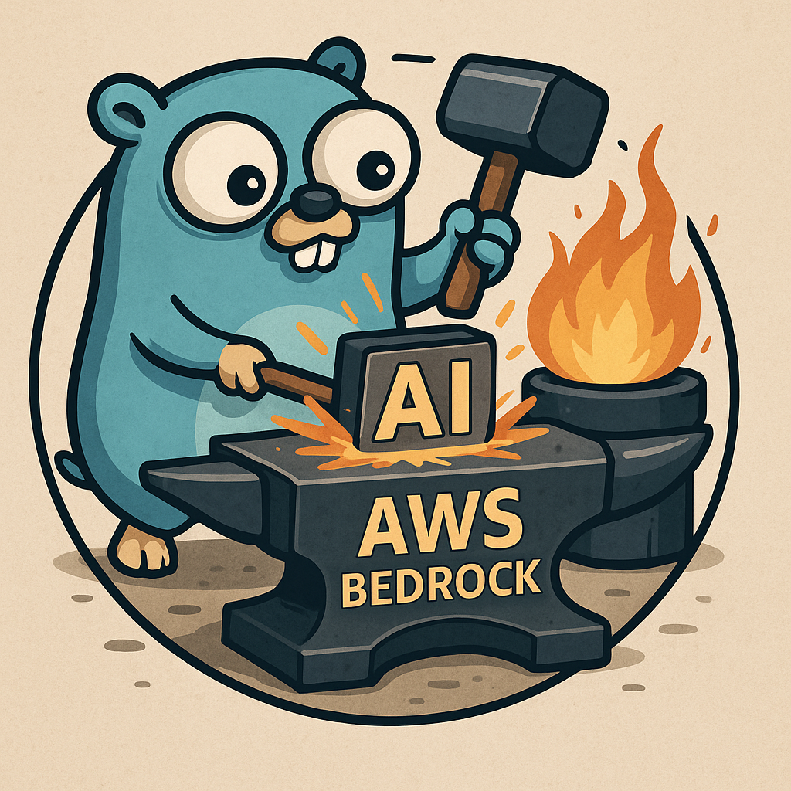

<div align="center">
  
  
  # Bedrock Forge

  **Enterprise platform for transforming YAML configurations into AWS Bedrock agent deployments using Terraform modules**
</div>

Bedrock Forge simplifies AWS Bedrock agent deployment by allowing teams to define agents, Lambda functions, action groups, knowledge bases, and IAM roles in simple YAML files, then automatically generating production-ready Terraform infrastructure.

## 🚀 Core Capabilities

- **YAML-to-Terraform Generation**: Transform declarative YAML configurations into Terraform modules
- **Complete Resource Support**: Agents, Lambda functions, Action Groups, Knowledge Bases, Guardrails, Prompts, IAM Roles, and Custom Modules
- **Custom Module Integration**: Include your own Terraform modules alongside Bedrock resources
- **Dependency Management**: Automatic resource ordering and cross-module references
- **Artifact Packaging**: Automatic Lambda code packaging and S3 upload
- **Schema Management**: OpenAPI schema discovery and validation
- **IAM Security**: Automatic IAM role generation with comprehensive permissions

## 🏢 Enterprise Features

- **GitHub Actions Integration**: Complete CI/CD pipeline with automated deployment
- **Multi-Environment Support**: Development, staging, and production deployments
- **Security Best Practices**: Least-privilege IAM roles and enterprise compliance patterns
- **Scalable Architecture**: Support for complex enterprise deployments
- **Team Collaboration**: Git-based workflow with approval processes

## 🏃 Quick Start

### Installation

#### Option 1: Install Globally (Recommended)

```bash
# Install directly from GitHub
go install github.com/your-org/bedrock-forge/cmd/bedrock-forge@latest

# Verify installation
bedrock-forge version
```

#### Option 2: Clone and Build

```bash
# Clone the repository
git clone https://github.com/your-org/bedrock-forge
cd bedrock-forge

# Build and install globally
go build -o bedrock-forge ./cmd/bedrock-forge
sudo mv bedrock-forge /usr/local/bin/

# Or just build locally
go build -o bedrock-forge ./cmd/bedrock-forge
./bedrock-forge version
```

#### Prerequisites
- Go 1.21+ installed
- AWS CLI configured with appropriate credentials
- Terraform 1.0+ installed

### Basic Usage

1. **Create your first agent**:
```yaml
# agents/my-agent.yml
kind: Agent
metadata:
  name: "my-agent"
  description: "My first Bedrock agent"
spec:
  foundationModel: "anthropic.claude-3-sonnet-20240229-v1:0"
  instruction: "You are a helpful assistant"
  # IAM role is automatically generated!
```

2. **Generate Terraform**:
```bash
./bedrock-forge generate . ./terraform
```

3. **Deploy**:
```bash
cd terraform
terraform init
terraform plan
terraform apply
```

## 🔧 CLI Commands

### `bedrock-forge scan [path]`
Discover and list all resources in the specified directory.
```bash
./bedrock-forge scan .
./bedrock-forge scan ./examples
```

### `bedrock-forge validate [path]`
Validate YAML syntax and dependencies.
```bash
./bedrock-forge validate .
./bedrock-forge validate ./agents
```

### `bedrock-forge generate [input-path] [output-path]`
Generate Terraform configuration from YAML resources.
```bash
./bedrock-forge generate . ./terraform
./bedrock-forge generate ./examples ./output
```

### `bedrock-forge version`
Show version information.
```bash
./bedrock-forge version
```

## 📦 Supported AWS Resources

| Resource Type | Description | Auto-IAM | Documentation |
|---------------|-------------|----------|---------------|
| **Agent** | AWS Bedrock agents with guardrails and action groups | ✅ | [docs/resources/agent.md](docs/resources/agent.md) |
| **Lambda** | AWS Lambda functions with automatic packaging | ✅ | [docs/resources/lambda.md](docs/resources/lambda.md) |
| **ActionGroup** | Action groups linking agents to Lambda functions | ✅ | [docs/resources/action-group.md](docs/resources/action-group.md) |
| **KnowledgeBase** | Vector knowledge bases with S3 data sources | ✅ | [docs/resources/knowledge-base.md](docs/resources/knowledge-base.md) |
| **Guardrail** | Content safety and compliance guardrails | ✅ | [docs/resources/guardrail.md](docs/resources/guardrail.md) |
| **Prompt** | Custom prompts with multiple variants | ✅ | [docs/resources/prompt.md](docs/resources/prompt.md) |
| **IAMRole** | Custom IAM roles for advanced scenarios | N/A | [docs/resources/iam-role.md](docs/resources/iam-role.md) |
| **CustomModule** | Integration with existing Terraform modules | N/A | [docs/resources/custom-module.md](docs/resources/custom-module.md) |
| **OpenSearchServerless** | OpenSearch serverless for knowledge bases | ✅ | [docs/resources/opensearch-serverless.md](docs/resources/opensearch-serverless.md) |

## 🔐 IAM Role Management

**🎉 IAM roles are automatically generated for all Bedrock resources!** 

- **Agents**: Get comprehensive permissions for foundation models, Lambda invocation, knowledge bases, and CloudWatch logging
- **Lambda Functions**: Get execution roles with VPC access and CloudWatch logging
- **Action Groups**: Inherit permissions from associated agent roles
- **Knowledge Bases**: Get permissions for S3 access and OpenSearch operations

For enterprise scenarios requiring custom permissions, see [docs/resources/iam-role.md](docs/resources/iam-role.md).

## 🔄 GitHub Actions Integration

Complete CI/CD pipeline with validation, packaging, and deployment stages. Compatible with enterprise AWS credential patterns.

See [docs/github-actions-guide.md](docs/github-actions-guide.md) for setup instructions.

## 📚 Documentation

### Getting Started
- [docs/getting-started.md](docs/getting-started.md) - Complete setup walkthrough
- [docs/examples/](docs/examples/) - Real-world examples and templates

### Resource Reference
- [docs/resources/](docs/resources/) - Detailed documentation for each resource type
- [docs/iam-management.md](docs/iam-management.md) - IAM roles and permissions guide

### Enterprise Setup
- [docs/enterprise-setup.md](docs/enterprise-setup.md) - Multi-environment deployments
- [docs/github-actions-guide.md](docs/github-actions-guide.md) - CI/CD setup
- [docs/custom-modules.md](docs/custom-modules.md) - Infrastructure integration

### Development
- [docs/internal-architecture-guide.md](docs/internal-architecture-guide.md) - Internal architecture
- [docs/enterprise-validation-guide.md](docs/enterprise-validation-guide.md) - Validation patterns

## 🆘 Support

- **Documentation**: [docs/](./docs/)
- **Issues**: [GitHub Issues](https://github.com/your-org/bedrock-forge/issues)
- **Discussions**: [GitHub Discussions](https://github.com/your-org/bedrock-forge/discussions)
- **Enterprise Support**: Contact your platform team

---

**Bedrock Forge** - Simplifying AWS Bedrock deployments for enterprise teams.