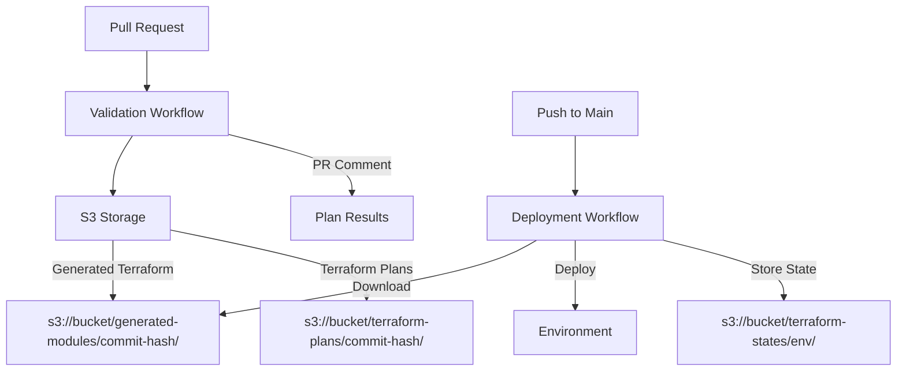

# GitHub Actions Integration Guide

This guide shows how to use the Bedrock Forge GitHub Actions workflows to validate and deploy your AWS Bedrock agents and resources with complete CI/CD automation.

## Table of Contents

- [Overview](#overview)
- [Workflow Architecture](#workflow-architecture)
- [Quick Start](#quick-start)
- [Validation Workflow](#validation-workflow)
- [Deployment Workflow](#deployment-workflow)
- [Configuration Reference](#configuration-reference)
- [Authentication Setup](#authentication-setup)
- [Advanced Usage](#advanced-usage)
- [Troubleshooting](#troubleshooting)

## Overview

Bedrock Forge provides two complementary GitHub Actions workflows that implement CI/CD best practices:

### 🔍 **Validation Workflow** (`bedrock-forge-validate.yml`)
- **Purpose**: Validate YAML configurations and generate Terraform plans
- **Triggers**: Pull requests, manual dispatch
- **Features**: YAML validation, Terraform generation, plan visibility, S3 storage
- **Security**: No deployments, read-only validation

### 🚀 **Deployment Workflow** (`bedrock-forge-deploy.yml`)
- **Purpose**: Deploy pre-validated Terraform configurations
- **Triggers**: Push to main, manual dispatch with approval
- **Features**: S3 artifact retrieval, environment-specific deployment, state management
- **Security**: Requires validated artifacts, environment protection

## Workflow Architecture



**Key Benefits:**
- **Separation of Concerns**: Validation runs on PRs, deployment on main
- **Transparency**: See exactly what Terraform will deploy before it happens
- **Security**: No accidental deployments from validation
- **Auditability**: Complete artifact and plan history in S3
- **Reproducibility**: Deploy the exact same validated configuration

## Quick Start

### 1. Prerequisites

Before using the Bedrock Forge workflows, ensure you have:

- AWS account with appropriate permissions
- GitHub repository with your Bedrock YAML configurations
- AWS IAM roles configured for GitHub Actions (validation and deployment)
- S3 bucket for Terraform artifacts and state storage
- DynamoDB table for state locking (optional but recommended)

### 2. Required Secrets

Add these secrets to your GitHub repository:

```
AWS_VALIDATION_ROLE=arn:aws:iam::123456789012:role/github-actions-validation
AWS_DEPLOYMENT_ROLE=arn:aws:iam::123456789012:role/github-actions-deployment
TERRAFORM_ARTIFACTS_BUCKET=your-terraform-artifacts-bucket
TERRAFORM_STATE_BUCKET=your-terraform-state-bucket
```

### 3. Create Validation Workflow

Create `.github/workflows/validate-bedrock.yml` for PR validation:

```yaml
name: Validate Bedrock Configuration

on:
  pull_request:
    branches: [main]
    paths:
      - '**/*.yml'
      - '**/*.yaml'

jobs:
  validate:
    uses: your-org/bedrock-forge/.github/workflows/bedrock-forge-validate.yml@main
    secrets: inherit
```

### 4. Create Deployment Workflow

Create `.github/workflows/deploy-bedrock.yml` for production deployment:

```yaml
name: Deploy Bedrock Agents

on:
  push:
    branches: [main]
    paths:
      - '**/*.yml'
      - '**/*.yaml'

jobs:
  deploy-dev:
    uses: your-org/bedrock-forge/.github/workflows/bedrock-forge-deploy.yml@main
    with:
      environment: dev
      aws_role: ${{ secrets.AWS_DEPLOYMENT_ROLE }}
      tf_state_bucket: ${{ secrets.TERRAFORM_STATE_BUCKET }}
    secrets: inherit
```

### 5. Workflow in Action

1. **Create PR**: Validation workflow runs automatically
2. **Review Plan**: Check generated Terraform plan in PR comments
3. **Merge PR**: Deployment workflow deploys to dev environment
4. **Manual Deploy**: Deploy to staging/prod with approval

## Validation Workflow

The validation workflow (`bedrock-forge-validate.yml`) provides comprehensive validation and planning capabilities:

### Features

- **YAML Validation**: Ensures all configuration files are valid
- **Resource Scanning**: Identifies all resources to be created
- **Terraform Generation**: Creates Terraform modules from YAML
- **Plan Execution**: Runs `terraform plan` to show what will be deployed
- **S3 Storage**: Stores generated artifacts with commit hash for traceability
- **PR Comments**: Adds detailed validation results to pull requests

### Usage

```yaml
name: Validate Bedrock Configuration

on:
  pull_request:
    branches: [main]
    paths: ['**/*.yml', '**/*.yaml']

jobs:
  validate:
    uses: your-org/bedrock-forge/.github/workflows/bedrock-forge-validate.yml@main
    with:
      aws_region: us-east-1
      source_path: ./configs
    secrets: inherit
```

### S3 Storage Structure

```
s3://your-terraform-bucket/
├── generated-modules/
│   ├── abc123def456/          # Commit hash
│   │   ├── main.tf
│   │   ├── variables.tf
│   │   └── outputs.tf
├── terraform-plans/
│   ├── abc123def456/
│   │   ├── plan.txt
│   │   └── plan-detailed.txt
```

## Deployment Workflow

The deployment workflow (`bedrock-forge-deploy.yml`) handles secure, environment-specific deployments:

### Features

- **Pre-validation Check**: Ensures Terraform modules exist in S3
- **Environment Protection**: Requires approval for production deployments
- **State Management**: Uses S3 backend with DynamoDB locking
- **Rollback Safety**: Downloads exact validated artifacts
- **Multi-Environment**: Supports dev, staging, production

### Usage

```yaml
name: Deploy Bedrock Agents

on:
  push:
    branches: [main]
  workflow_dispatch:
    inputs:
      environment:
        description: 'Environment to deploy'
        required: true
        type: choice
        options: [dev, staging, prod]
      commit_hash:
        description: 'Specific commit to deploy'
        required: false

jobs:
  deploy-dev:
    uses: your-org/bedrock-forge/.github/workflows/bedrock-forge-deploy.yml@main
    with:
      environment: dev
      aws_role: ${{ secrets.AWS_DEPLOYMENT_ROLE }}
      tf_state_bucket: ${{ secrets.TERRAFORM_STATE_BUCKET }}
    secrets: inherit

  deploy-staging:
    if: github.event_name == 'workflow_dispatch'
    uses: your-org/bedrock-forge/.github/workflows/bedrock-forge-deploy.yml@main
    with:
      environment: staging
      aws_role: ${{ secrets.AWS_DEPLOYMENT_ROLE }}
      tf_state_bucket: ${{ secrets.TERRAFORM_STATE_BUCKET }}
      commit_hash: ${{ inputs.commit_hash }}
    secrets: inherit
    environment: staging  # Requires approval

  deploy-prod:
    if: github.event_name == 'workflow_dispatch'
    uses: your-org/bedrock-forge/.github/workflows/bedrock-forge-deploy.yml@main
    with:
      environment: prod
      aws_role: ${{ secrets.AWS_DEPLOYMENT_ROLE }}
      tf_state_bucket: ${{ secrets.TERRAFORM_STATE_BUCKET }}
      commit_hash: ${{ inputs.commit_hash }}
    secrets: inherit
    environment: production  # Requires approval
```

## Configuration Reference

### Validation Workflow Inputs

| Input | Description | Required | Default |
|-------|-------------|----------|---------|
| `target_branch` | Target branch for validation | No | `main` |
| `aws_region` | AWS region for validation | No | `us-east-1` |
| `source_path` | Path to YAML configurations | No | `.` |

### Deployment Workflow Inputs

| Input | Description | Required | Default |
|-------|-------------|----------|---------|
| `commit_hash` | Specific commit to deploy | No | `github.sha` |
| `environment` | Environment to deploy | Yes | `dev` |
| `aws_region` | AWS region for deployment | No | `us-east-1` |
| `aws_role` | AWS IAM role ARN | Yes | - |
| `tf_state_bucket` | S3 bucket for Terraform state | Yes | - |
| `tf_state_key_prefix` | Key prefix for state files | No | `bedrock-forge` |
| `tf_state_lock_table` | DynamoDB table for locking | No | - |
| `dry_run` | Plan only, no apply | No | `false` |
| `force_regenerate` | Force regenerate Terraform | No | `false` |

### Required Secrets

| Secret | Description | Used By |
|--------|-------------|---------|
| `AWS_VALIDATION_ROLE` | IAM role for validation | Validation workflow |
| `AWS_DEPLOYMENT_ROLE` | IAM role for deployment | Deployment workflow |
| `TERRAFORM_ARTIFACTS_BUCKET` | S3 bucket for artifacts | Both workflows |
| `TERRAFORM_STATE_BUCKET` | S3 bucket for state | Deployment workflow |

## Authentication Setup

### AWS IAM Roles

Create two IAM roles for GitHub Actions:

#### Validation Role (Read-Only)
```json
{
  "Version": "2012-10-17",
  "Statement": [
    {
      "Effect": "Allow",
      "Action": [
        "bedrock:*",
        "lambda:GetFunction",
        "lambda:ListFunctions",
        "iam:GetRole",
        "iam:ListRoles",
        "s3:GetObject",
        "s3:PutObject",
        "s3:ListBucket"
      ],
      "Resource": "*"
    }
  ]
}
```

#### Deployment Role (Full Access)
```json
{
  "Version": "2012-10-17",
  "Statement": [
    {
      "Effect": "Allow",
      "Action": [
        "bedrock:*",
        "lambda:*",
        "iam:*",
        "s3:*",
        "opensearch:*",
        "opensearchserverless:*"
      ],
      "Resource": "*"
    }
  ]
}
```

### Trust Relationship

Both roles need this trust relationship:

```json
{
  "Version": "2012-10-17",
  "Statement": [
    {
      "Effect": "Allow",
      "Principal": {
        "Federated": "arn:aws:iam::YOUR_ACCOUNT_ID:oidc-provider/token.actions.githubusercontent.com"
      },
      "Action": "sts:AssumeRole",
      "Condition": {
        "StringEquals": {
          "token.actions.githubusercontent.com:sub": "repo:YOUR_ORG/YOUR_REPO:ref:refs/heads/main"
        }
      }
    }
  ]
}
```

## Advanced Usage

### Multi-Environment Deployment

```yaml
name: Multi-Environment Deployment

on:
  push:
    branches: [main]
  workflow_dispatch:
    inputs:
      environment:
        type: choice
        options: [dev, staging, prod]
        default: dev

jobs:
  deploy-dev:
    uses: your-org/bedrock-forge/.github/workflows/bedrock-forge-deploy.yml@main
    with:
      environment: dev
    secrets: inherit

  deploy-staging:
    if: github.event_name == 'workflow_dispatch' && inputs.environment == 'staging'
    needs: deploy-dev
    uses: your-org/bedrock-forge/.github/workflows/bedrock-forge-deploy.yml@main
    with:
      environment: staging
    secrets: inherit
    environment: staging

  deploy-prod:
    if: github.event_name == 'workflow_dispatch' && inputs.environment == 'prod'
    needs: deploy-staging
    uses: your-org/bedrock-forge/.github/workflows/bedrock-forge-deploy.yml@main
    with:
      environment: prod
    secrets: inherit
    environment: production
```

### Cross-Region Deployment

```yaml
jobs:
  deploy-us-east-1:
    uses: your-org/bedrock-forge/.github/workflows/bedrock-forge-deploy.yml@main
    with:
      environment: prod
      aws_region: us-east-1
    secrets: inherit

  deploy-eu-west-1:
    uses: your-org/bedrock-forge/.github/workflows/bedrock-forge-deploy.yml@main
    with:
      environment: prod
      aws_region: eu-west-1
    secrets: inherit
```

### Artifact Inspection

View generated Terraform modules and plans:

```bash
# List all generated modules
aws s3 ls s3://your-terraform-bucket/generated-modules/

# Download specific commit modules
aws s3 cp s3://your-terraform-bucket/generated-modules/abc123def456/ ./terraform-modules/ --recursive

# View terraform plan
aws s3 cp s3://your-terraform-bucket/terraform-plans/abc123def456/plan.txt ./plan.txt
cat plan.txt
```

## Troubleshooting

### Common Issues

#### 1. No Validated Terraform Modules Found
**Error**: "No validated Terraform modules available for commit abc123"

**Solution**: Run validation workflow first or use `force_regenerate: true`

#### 2. S3 Access Denied
**Error**: "Access Denied" when accessing S3 bucket

**Solution**: Verify IAM role has S3 permissions and bucket policy allows access

#### 3. Terraform Plan Fails
**Error**: Terraform plan fails during validation

**Solution**: Check AWS permissions and resource dependencies

#### 4. Environment Not Found
**Error**: Environment protection rules not applied

**Solution**: Configure environment protection rules in GitHub repository settings

### Debug Mode

Enable debug output by setting repository variables:

```
ACTIONS_RUNNER_DEBUG=true
ACTIONS_STEP_DEBUG=true
```

### Support

For issues with the workflows:
1. Check the workflow logs in GitHub Actions
2. Verify S3 bucket permissions and contents
3. Confirm IAM roles and trust relationships
4. Test Terraform generation locally with `bedrock-forge generate`